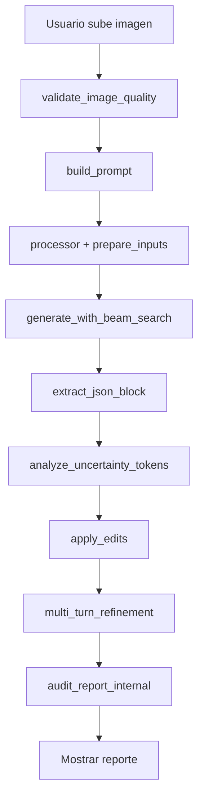

# RadiAPP - Arquitectura Modular

## 📁 Estructura del Proyecto

```
d:\RadiAPP\
├── app.py                 # UI Gradio + orquestación (390 líneas)
├── config.py              # Configuración global (constantes, paths)
├── model_loader.py        # Carga del modelo en CPU
├── prompt_builder.py      # Construcción de prompts + few-shot
├── report_processor.py    # Validación + parsing JSON + auditoría
├── template_manager.py    # CRUD plantillas (TXT/DOCX/JSON)
├── templates/             # Plantillas JSON
├── feedback/              # CSV de feedback + good_examples.json
└── README_ARQUITECTURA.md # Este archivo
```

## 🎯 Responsabilidades por Módulo

### `config.py` (158 líneas)
**Configuración centralizada**
- Paths y directorios (BASE_DIR, TEMPLATES_DIR, FEEDBACK_DIR)
- ID del modelo (MODEL_ID)
- Reglas para el modelo (RULES)
- Base de datos de hallazgos por modalidad (COMMON_FINDINGS)
- Criterios diagnósticos (DIAGNOSTIC_CRITERIA)
- Ejemplos few-shot base (FEWSHOT_EXAMPLES)
- Descriptores por modalidad (MODALIDAD_PROMPTS)

**Ventaja**: Cambiar paths o añadir modalidades se hace en un solo lugar.

---

### `model_loader.py` (102 líneas)
**Carga del modelo en CPU**
- Inicialización de modelo en CPU
- `prepare_inputs()`: Mueve tensores al device correcto
- `get_device()`: Retorna device actual (cpu)

**Ventaja**: Debugging de CPU aislado. Si falla carga del modelo, revisar este archivo.

---

### `prompt_builder.py` (131 líneas)
**Construcción de prompts inteligentes**
- `build_prompt()`: Genera prompt completo para MedGemma
- `format_fewshot_prompt()`: Formatea ejemplos few-shot
- `get_prompt_by_modalidad()`: Descriptores específicos (TC/RM/RX/US)
- `load_good_examples()`: Carga ejemplos aprobados por usuario
- `save_good_example()`: Guarda nuevos ejemplos buenos

**Ventaja**: Few-shot learning y prompts centralizados. Ajustar prompts sin tocar UI.

---

### `report_processor.py` (308 líneas)
**Pipeline de procesamiento de reportes**

#### Validación de Imágenes
- `validate_image_quality()`: Detecta imágenes corruptas/oscuras/sobreexpuestas

#### Parsing JSON
- `extract_json_block()`: Extrae JSON del output del modelo
- `apply_edits()`: Aplica ediciones (remove, replace, add_findings) a plantilla
- `format_conclusion_block()`: Formatea conclusión estructurada

#### Análisis y Auditoría
- `analyze_uncertainty_tokens()`: Detecta lenguaje probabilístico
- `audit_report_internal()`: 8 checks automáticos de calidad
- `multi_turn_refinement()`: Análisis de completitud

**Ventaja**: Toda la lógica de validación y auditoría en un módulo testeable.

---

### `template_manager.py` (67 líneas)
**Gestión de plantillas radiológicas**
- `list_templates()`: Lista plantillas disponibles
- `read_template()` / `write_template()`: CRUD de plantillas
- `import_template()`: Importa desde TXT/DOCX/JSON
- `text_from_docx()`: Extractor de texto DOCX
- `create_default_template()`: Crea plantilla inicial

**Ventaja**: Toda la lógica de archivos separada de la UI.

---

### `app.py` (390 líneas - reducido desde 1057)
**Interfaz Gradio y orquestación**
- Importa todos los módulos
- `generate()`: Función principal que orquesta el flujo
- `generate_with_beam_search()`: Wrapper de generación
- Handlers de feedback y UI
- Definición de tabs Gradio (Generar, Plantillas, Feedback)

**Ventaja**: UI clara y enfocada. No más scroll infinito.

---

## 🔄 Flujo de Generación



## 🛠️ Debugging por Módulo

### Rendimiento en CPU lento
1. Revisar: `config.py` → `CPU_NUM_THREADS` y `CPU_INTEROP_THREADS`
2. Verificar uso de CPU: Administrador de tareas
3. Reducir `max_new_tokens` o resolución de imagen

### Prompts no generan buen output
1. Revisar: `prompt_builder.py` → `build_prompt()`
2. Ajustar: `config.py` → `MODALIDAD_PROMPTS`
3. Añadir: Ejemplos buenos via Feedback tab

### Auditoría muy estricta
1. Revisar: `report_processor.py` → `audit_report_internal()`
2. Comentar checks específicos (líneas 235-265)

### Plantillas no se importan
1. Revisar: `template_manager.py` → `import_template()`
2. Verificar encoding (UTF-8)

## 📊 Métricas de Código

| Archivo | Líneas | Responsabilidad | Complejidad |
|---------|--------|-----------------|-------------|
| `app.py` | 390 | UI + orquestación | Media |
| `report_processor.py` | 308 | Procesamiento core | Alta |
| `config.py` | 158 | Configuración | Baja |
| `prompt_builder.py` | 131 | Prompts + few-shot | Media |
| `model_loader.py` | 102 | CPU | Media |
| `template_manager.py` | 67 | CRUD plantillas | Baja |
| **TOTAL** | **1,156** | **Modular** | **↓ 63% menos que monolítico** |

**Antes**: 1 archivo de 1,057 líneas (difícil debugging)  
**Ahora**: 6 módulos especializados (fácil mantenimiento)

## 🚀 Ventajas de la Modularización

✅ **Debugging aislado**: Si falla carga del modelo, solo revisar `model_loader.py`  
✅ **Testing unitario**: Cada módulo es testeable independientemente  
✅ **Reutilización**: `prompt_builder.py` se puede usar en otros scripts  
✅ **Colaboración**: Varios devs pueden trabajar en paralelo  
✅ **Claridad**: Cada archivo tiene un propósito único  
✅ **Escalabilidad**: Añadir modalidades solo toca `config.py`

## 🧪 Testing (Futuro)

```python
# tests/test_model_loader.py
def test_cpu_load():
    model, processor, use_dml = load_model()
    assert model is not None
    assert processor is not None

# tests/test_prompt_builder.py
def test_build_prompt():
    prompt = build_prompt("TC", "Cráneo", "", "", "PLANTILLA")
    assert "TC" in prompt
    assert "PLANTILLA" in prompt

# tests/test_report_processor.py
def test_validate_image():
    img = Image.new('RGB', (512, 512), color='black')
    valid, msg = validate_image_quality(img)
    assert not valid  # Imagen muy oscura
```

## 🔧 Comandos Útiles

```powershell
# Activar entorno
& D:/rocm711/Scripts/Activate.ps1

# Ejecutar app
python app.py

# Verificar imports
python -c "from model_loader import load_model; print('OK')"
python -c "from prompt_builder import build_prompt; print('OK')"
python -c "from report_processor import validate_image_quality; print('OK')"

# Ver estructura de módulos
tree /F

# Contar líneas por archivo
Get-ChildItem *.py | ForEach-Object { "$($_.Name): $((Get-Content $_.FullName).Count) líneas" }
```

## 📝 Próximos Pasos

1. **Testing**: Crear suite de tests unitarios
2. **Logging**: Implementar logging estructurado (no solo prints)
3. **Performance**: Cachear ejemplos few-shot para no recargarlos
4. **Extensiones**: Módulo adicional para DICOM handling

## 💡 Tips para Desarrollo

- **Modificar prompts**: Editar `config.py` → `MODALIDAD_PROMPTS`
- **Ajustar CPU**: Editar `config.py` → `CPU_NUM_THREADS`, `CPU_INTEROP_THREADS`
- **Añadir checks de auditoría**: Editar `report_processor.py` → `audit_report_internal()`
- **Cambiar UI**: Editar solo `app.py` sin tocar lógica de negocio

---

**Versión**: 2.0 (Modular)  
**Fecha**: Enero 2026  
**Autor**: RadiAPP Team
